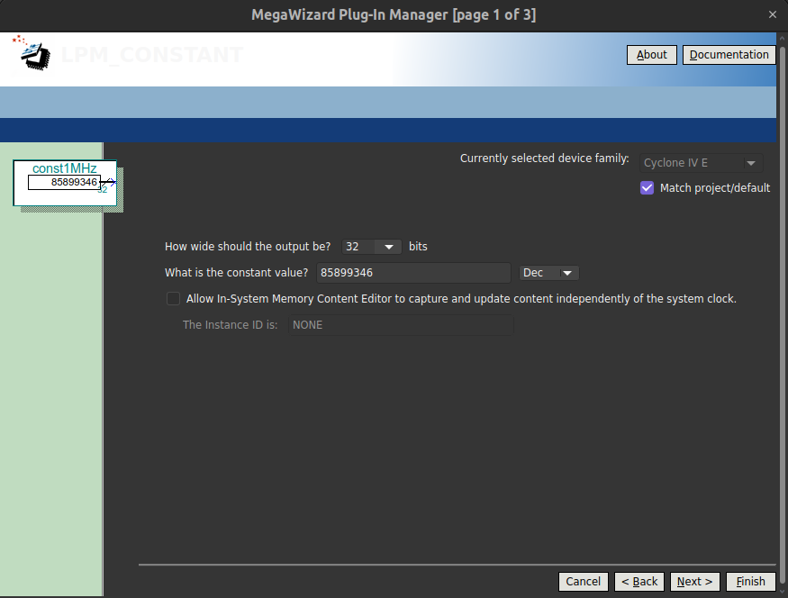

# Oficina-NCO  <!-- omit in toc -->

**Sumário**

- [Introdução](#introdução)
  - [Para o desenvolvimento será utilizado:](#para-o-desenvolvimento-será-utilizado)
- [Iniciar projeto](#iniciar-projeto)
- [Geração dos sinais senoidais](#geração-dos-sinais-senoidais)
- [Criação do LPM\_CONSTANT](#criação-do-lpm_constant)
- [Configurando o SignalTap para visualização dos sinais gerados](#configurando-o-signaltap-para-visualização-dos-sinais-gerados)
- [Somando os dois sinais](#somando-os-dois-sinais)
- [Criando o filtro no MATLAB](#criando-o-filtro-no-matlab)
  - [Importando o filtro no Quartus II](#importando-o-filtro-no-quartus-ii)
- [Tratando o sinal](#tratando-o-sinal)


## Introdução
Este repositório tem como objetivo atualizar a oficina [Oficina NCO e Filtros digitais](https://wiki.sj.ifsc.edu.br/index.php/Oficina_NCO_e_Filtros_digitais), que traz um roteiro para a geração de sinais senoidais e a construção de filtros digitais em FPGAs Altera, utilizando o Quartus II. 

O sistema desenvolvido possui a capacidade de gerar sinais senoidais de 1 MHz e 4 MHz, somar os dois sinais e realizar uma filtragem passa baixas para manter apenas o sinal de 1 MHz. Também será realizado a construção de um divisor de *clock* para realizar uma subamostragem nos sinais. Os blocos do sistema utilizam o *MegaWizard Plug-In Manager*.

<!--  uma ferramenta nativa do Quartus II. O projeto foi desenvolvido no kit didático Altera DE2-115, que inclui o FPGA Cyclone IV EP4CE115F29C7.

 pois utiliza versões antigas do software [Quartus](https://www.intel.com.br/content/www/br/pt/products/details/fpga/development-tools/quartus-prime.html). -->

<!--  -->


### Para o desenvolvimento será utilizado:

- [Quartus II - v20.1](https://www.intel.com/content/www/us/en/software-kit/661015/intel-quartus-prime-standard-edition-design-software-version-20-1-for-windows.html)
- Sistema Operacional [Ubuntu 22.04](https://ubuntu.com/download/desktop)
-  kit didático [Altera DE2-115](https://wiki.sj.ifsc.edu.br/index.php/Interfaces_de_entrada_e_sa%C3%ADda_da_DE2-115), que inclui o FPGA Cyclone IV EP4CE115F29C7.


## Iniciar projeto

Antes de seguir os passos, certifique-se de ter criado um novo projeto no `Quartus II`. Utilize o tutorial [Preparando para gravar o circuito lógico no FPGA](https://wiki.sj.ifsc.edu.br/index.php/Preparando_para_gravar_o_circuito_l%C3%B3gico_no_FPGA) para configuração e gravação da placa.

- Crie um novo arquivo de *Block Diagram/Schematic File*

## Geração dos sinais senoidais

Nesta seção, dois sinais senoidais serão criados, um de 1 MHz e outro de 4 MHz, para isso siga os seguintes passos no arquivo criado:

1. Na aba `Tools` clique em `IP Catalog` e pesquise por `nco`, em *`Signal Generation`* clique em `NCO`. 
<!-- ```
Installed IP
├── Library
├── DSP
│   └── Signal Generation
        └── NCO     
``` -->

<p align="center">
  
</p>

2. Na janela *`New IP Variation`*, seção *`Create IP Variation`*, defina o nome da entidade (*`Entity name`*) e escolha o local para salvar os arquivos (sugestão: `nco1MHz` e `nco4MHz`).

<p align="center">
  
</p>

> __Obs__: Na seção *`Target Device`* certifique-se que *`Family`* esteja definida como `Cyclone IV E` e *`device`* igual a `EP4CE115F29C7`.

3. Na janela *`IP Parameter Editor`* :

   - Defina os seguintes parâmetros de *`Architecture`*:

     - `Generation Algorithm:` Multiplier-based
     - `Outputs:` Dual Output
     - `Number of Channels:` 1
     - `Number of Bands:` 1
  
   - Defina os seguintes parâmetros de *`Frequency`*:
     - `Phase Accumulator Precision:` 32 bits
     - `Angular Resolution:` 16 bits
     - `Magnitude Resolution:` 10 bits 
     - `Dither Level:` 4
     - `Clock Rate:` 50 MHz
     - `Desired Increment Value:` 1.0 MHz
     - Em `Phase Increment Value`, anote o valor disponibilizado (Para 1MHz, 85899346). Esse número pode ser encontrado através da equação:

     $$PIV = \left (\frac{DOF}{CR}\right) PAP$$

      - Após finalizar as configurações, clique em `Generate VHDL`.
      - Na janela `Generation` aba `Synthesys` modifique o `Create HDL design` para `VHDL` e clique em `Generate`.
      - Ao finalizar o processo de geração do código `VHDL`, clique em finish.
      - Note que ao retornar para janela padrão do Quartus II, não foi adicionado um novo arquivo ao projeto com nome de `nco1MHz.qip`.
      - Ao retornar para janela padrão do Quartus II verifique se `nco1MHz.qip` está em files. Caso não esteja, adicione ao projeto. 


<p align="center">
  
</p>
   
> O mesmo procedimento deve ser realizado para o NCO de 4 MHz, ao criar o nco4MHz terá o seguinte `Phase Increment Value:343597384`.


## Criação do LPM_CONSTANT

Nesta seção, dois LPM_CONSTANT devem ser criados, sendo um para o NCO de 1 MHz e outro para 4 MHz, para isso siga os seguintes passos:

1. Na aba `Tools` clique em `IP Catalog` e pesquise por `lpm_constant`. Em *`Library`*, clique em `LPM_CONSTANT`. Em seguida, atribua um nome como `const1MHz` e certifique-se de marcar a opção `VHDL` na aba `IP variation file type`. 
   
2. Na janela `MegaWizard` defina os seguintes parâmetros:
      - `Output:` 32 bits
      - `Constant value:` 85899346 (Dec)
  > O número de bits da constante é 32 para estar de acordo com o esperado pelo NCO e o valor decimal (85899346) é obtido com o NCO de 1 MHz.

3. Ao finalizar a parametrização, clique em next. Na aba `Summary`, marque todas as opções de arquivos disponíveis e clique em `Finish`.
   
4. Por fim, crie o `lpm_constant` para 4 MHz. Para isso, siga os passos descritos acima, modificando apenas o parâmetro `Constant value: 343597384 (Dec)`.

<p align="center">
  
</p>

<p align="center">
  
</p>

 
5. Adicione os componentes ao projeto e realize as ligações como abaixo:

<p align="center">
  
</p>

> Repare que a etrada `phi_inc[31..0]` controla o incremento do `NCO` para a geração do sinal senoidal, e a constante `Phase Increment Value` deve ser passada. 

1. Compile o projeto, e no **Pin Planner** (menu Assignments), configure apenas a porta **clk50MHz**, no Location **PIN_Y2**

## Configurando o SignalTap para visualização dos sinais gerados


1. Adicione um novo arquivo ao projeto, no tipo do arquivo selecione `SignalTap II Logic Analyzer File`.

<p align="center">
  
</p>

2. Na aba `Setup` (primeiro passo da imagem abaixo), dê um duplo-clique na área em branco.

<p align="center">
  
</p>

3. Na janela `Node Finder` selecione os sinais conforme abaixo: 

<p align="center">
  
</p>

  - Em Filter, selecione `SignalTap II: pre-synthesis`
  - Clique no botão `List`
  - Na janela `Nodes Found`, selecione os sinais:
      - seno1MHz
      - seno4MHz
      - valid1MHz
      - valid4MHz
   - Com o botão `>` mova para direita os sinais e clique em `Insert`.

4. Na janela `Signal Configuration` (terceiro passo da imagem). Na seção `Clock`, clique no botão ... e use o mesmo procedimento para encontrar o sinal `clk50MHz`.

5. Na janela `JTAG Chain Configuration` (segundo passo da imagem), clique em `setup` e configure a placa para gravação. Em seguida, clique no botão ... e selecione com extensão `NOME_PROJETO.sof`.

6. Salve o arquivo com o nome `stp2.stp` e compile o projeto clicando no botão realçado `Start Compilation`.

7. Inicie a captura de dados, clicando no botão realçado `Autorun Analysis` 

<p align="center">
  
</p>

8. Na aba `Data` (quarto passo da imagem), nas variáveis `sen1MHz` e `sen4MHz` clique com o botão direito e siga `Bus Display Format > Signed Line Chart`:
   
<p align="center">
  
</p>


9. Ao final é possível observar os senos conforme a imagem abaixo:


<p align="center">
  
</p>

## Somando os dois sinais

Os sinais senoidais usam bit de sinal obtido via complemento de dois. Para somar os dois sinais, acrescentaremos um bit à representação, e usaremos o componente `LPM_ADD_SUB` presente em `IP Catalog` para realizar a soma. Dê o nome de `soma11bits` e certifique-se de ter selecionado `VHDL` na aba `IP variation file type`.


1. Escolha o número de `11 bits` para os sinais e selecione `Addition only`, em seguida, clique em `next`.
<p align="center">
  
</p>

2. Na aba `General 2`, mude o tipo da adição para `Signed` e clique em `next`. 
<p align="center">
  
</p>

3. Na aba `Summary`, selecione todos os arquivos disponíveis e clique em `Finish`.
<p align="center">
  
</p>

4. Adicione o somador ao projeto, puxe uma derivação dos fios de saída de cada sinal senoidal, dando o nome de s1[9] e s2[9].
   
5. Nas portas de entrada do somador, ligue à cada uma das derivações, repetindo bit mais significativo. Para isso, dê os nomes s1[9], s1[9..0] e s2[9], s2[9..0]. Por fim, crie uma porta de saída com nome soma[10..0].

<p align="center">
  
</p>


6. Após isso, compile o projeto e adicione a porta `soma` ao `SignalTap II`. Compile novamente, faça a programação, e inicie a captura de sinais no SignalTap II. Configure a exibição do sinal de `soma` da mesma forma que os sinais senoidais.

<p align="center">
  
</p>

## Criando o filtro no MATLAB

1. Abra o Matlab e digite fdatool na barra de comandos para abrir a ferramenta de criação de filtros.

2. Na seção `Design method` selecione FIR e defina o tipo do filtro como `Window`.
3. Em `Options` mude o tipo de janelamento em `Window` para `Kaiser`.
4. Mude em `frequency Specification`:
   - `FS` : 50000000
   - `Fpass` : 1200000
   - `Fstop` : 2000000

5. Clique em `Design Filter`.
   
<p align="center">
  
</p>

6. Vá em `File>Export` no canto superior esquerdo.
7. Na seção `Export To` selecione `Coefficient File (ASCII)`.
8. Clique em `Export` para criar o arquivo que contém os coefientes do filtro.

<p align="center">
  
</p>

9. Utilize o código em python [processa_filtro](processa_filtro.py) para adequar os coeficientes para serem utilizados no `Quartus II`.
### Importando o filtro no Quartus II

1. Na janela `Tools > Ip Catalog` crie um novo componente `FIR II`.
2. Na aba `Coefficients` clique em `Import From File` e selecione o arquivo criado anteriormente pelo código [processa_filtro](processa_filtro.py). 

<p align="center">
  
</p>

3. Após importar o filtro vá na aba `Input/Output Options`, em `Input Width` altere para 11 bits.
4. Clique em `Finish` para gerar o componente do filtro.


<p align="center">
  
</p>

5. Adicione o filtro no projeto e faça as ligações necessárias como na imagem abaixo.

<p align="center">
  
</p>

6. Após isso, compile o projeto e adicione a porta `filtro` ao `SignalTap II`. Compile novamente, faça a programação, e inicie a captura de sinais no `SignalTap II`.

<p align="center">
  
</p>  

> Note que a representação do sinal possui bits repetidos (27-20)

## Tratando o sinal

1. Para possibilitar a análise do sinal filtrado, deve-se remover os bits repetidos, assim entre na aba `Setup` (canto inferior esquerdo do `Signal Tap II`).
2. Certifique-se que a captura foi encerrada e clique em `+` em `filtro[27..0]` e desmarque de `filtro[27]` até `filtro[21]` como na imagem abaixo.
<p align="center">
  
</p>

3. Compile novamente o projeto e inicie a captura de dados clicando no botão `Autorun Analysis`.

<p align="center">
  
</p>

> O descarte de bits realizado afetou apenas a visualização no `SignalTap II`. Para alterar efetivamento o sinal de saída do filtro, a interface de truncamento na configuração do `FIR II` pode ser usada, ou pode ser feita uma derivação dos sinais desejados na saída do filtro. 

