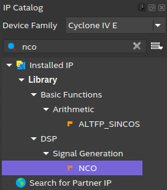

# Oficina-NCO  <!-- omit in toc -->

**Sumário**
- [Introdução](#introdução)
  - [Para o desenvolvimento será utilizado:](#para-o-desenvolvimento-será-utilizado)
- [Iniciar projeto](#iniciar-projeto)
- [Geração dos sinais senoidais](#geração-dos-sinais-senoidais)
- [Geração dos sinais senoidais](#geração-dos-sinais-senoidais-1)
- [Configurando o SignalTap para visualização dos sinais gerados](#configurando-o-signaltap-para-visualização-dos-sinais-gerados)
- [Somando os dois sinais](#somando-os-dois-sinais)
- [Criando o filtro no MATLAB](#criando-o-filtro-no-matlab)
- [Fazendo uma subamostragem dos sinais](#fazendo-uma-subamostragem-dos-sinais)

## Introdução

$a^2 + b^2 = c^2_{m}$

$$
x = \frac{-b \pm \sqrt{b^2 - 4ac}}{2a}
$$

Este repositório tem como objetivo atualizar a oficina [Oficina NCO e Filtros digitais](https://wiki.sj.ifsc.edu.br/index.php/Oficina_NCO_e_Filtros_digitais), que traz um roteiro para a geração de sinais senoidais e a construção de filtros digitais em FPGAs Altera, utilizando o Quartus II. 

O sistema desenvolvido possui a capacidade de gerar sinais senoidais de 1 MHz e 4 MHz, somar os dois sinais e realizar uma filtragem passa baixas para manter apenas o sinal de 1 MHz. Também será realizado a construção de um divisor de *clock* para realizar uma subamostragem nos sinais. Os blocos do sistema utilizam o *MegaWizard Plug-In Manager*.

<!--  uma ferramenta nativa do Quartus II. O projeto foi desenvolvido no kit didático Altera DE2-115, que inclui o FPGA Cyclone IV EP4CE115F29C7.

 pois utiliza versões antigas do software [Quartus](https://www.intel.com.br/content/www/br/pt/products/details/fpga/development-tools/quartus-prime.html). -->

<!--  -->


### Para o desenvolvimento será utilizado:

- [Quartus II - v20.1](https://www.intel.com/content/www/us/en/software-kit/661015/intel-quartus-prime-standard-edition-design-software-version-20-1-for-windows.html)
- Sistema Operacional [Ubuntu 22.04](https://ubuntu.com/download/desktop)
-  kit didático [Altera DE2-115](https://wiki.sj.ifsc.edu.br/index.php/Interfaces_de_entrada_e_sa%C3%ADda_da_DE2-115), que inclui o FPGA Cyclone IV EP4CE115F29C7.


## Iniciar projeto

## Geração dos sinais senoidais

Nesta seção, dois sinais senoidais serão criados, um de 1 MHz e outro de 4 MHz, para isso siga os seguintes passos:

1. Na aba `IP Catalog` pesquise por `nco`, em *`Signal Generation`* clique em `NCO`. 
<!-- ```
Installed IP
├── Library
├── DSP
│   └── Signal Generation
        └── NCO     
``` -->

<p align="center">
  
</p>

2. Na janela *`New IP Variation`*, seção *`Create IP Variation`*, defina o nome da entidade (*`Entity name`*) e escolha o local para salvar os arquivos (sugestão: `nco1MHz` e `nco4MHz`).
> __Obs__: Na seção *`Target Device`* certifique-se de que a *`Family`*  é `Cyclone IV E` e *`device`* igual a  `EP4CE115F29C7`


3. Após na janela *`IP Parameter Editor`*, seção *`Base Parameters`* deve ser definido os seguintes parâmetros da arquitetura:

    - `Genersation Algorithm:` Multiplier-based
    - ``
- Na janela do NCO, clique em 'Step1: Parameterize'
- Em 'Magnitude Precision', escolha o número de bits por amostra desejado para o sinal senoidal (sugestão: '10')
- Em 'Clock Rate', escolha o clock da placa (no caso, 50 MHz). Digite o valor e tecle ENTER
- Em 'Desired Output Frequency', escolha a frequência desejada para o sinal senoidal (1 MHz). Digite o valor e tecle ENTER
- Anote o valor disponibilizado em 'Phase Increment Value' (Para 1MHz, 85899346). Você pode dar dois cliques no valor e usar o CTRL+C para copiar. Esse número pode ser encontrado também através da equação:

PIV = (DOF / CR) * PAP

onde as siglas se referem às iniciais dos parâmetros


- No canto superior direito da aba 'Implementation', marque a opção 'Single Output'
- Clique em 'Finish' para encerrar a parametrização
- Clique em 'Generate' para gerar o bloco
- Quando o processamento encerrar, clique em 'Exit' e selecione 'Yes' quando questionado sobre adicionar o arquivo gerado ao projeto
- De volta à janela padrão do 'Quartus II' repare que o arquivo 'nco1MHz.qip' foi adicionado ao projeto


O mesmo procedimento deve ser feito para o NCO de 4 MHz ('Phase Increment Value' 343597384)

Com os dois NCOs criados, adicione-o ao projeto. Repare que ele possui entradas de clock, um reset ativo baixo (repare no "_n" no nome da entrada), um enable e uma entrada de 32 bits chamada 'phi_inc_i[31..0]'. É através dessa entrada que o NCO é controlado, e a constante 'Phase Increment Value' deve ser passada. Para isso, use um outro MegaWizard, o 'LPM_CONSTANT'. Ao fazer sua configuração, use o nome 'const1MHz' e 'const4MHz'. Sua parametrização é simples, com o número de bits da constante (32, para estar de acordo com o esperado pelo NCO), e o seu valor em decimal (85899346 e 343597384). Na página 'Summary', marque todos os tipos de arquivo disponíveis.

Adicione os componentes ao projeto e realize as ligações como abaixo:


Compile o projeto, e no '


## Geração dos sinais senoidais

Nesta seção, dois sinais senoidais serão criados, um de 1 MHz e outro de 4 MHz, para isso siga os seguintes passos:

- Em `IP Catalog` pesquise por `nco`
## Configurando o SignalTap para visualização dos sinais gerados

## Somando os dois sinais

## Criando o filtro no MATLAB

## Fazendo uma subamostragem dos sinais